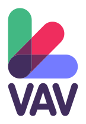

<p align="center">
    
</p>
<h1 align="center">Vue + A-Frame + Vite boilerplate</h1>

> A boilerplate for A-Frame, Vue and Vite


### [>> DEMO <<](https://onivers.com/aframe-vue-boilerplate/)

## Included in the boilerplate

### Libs and components

- [aframe-extras](https://github.com/c-frame/aframe-extras) (MIT License)
- [aframe physx](https://github.com/c-frame/physx) (MIT License)
- [aframe-blink-controls](https://github.com/jure/aframe-blink-controls) (MIT License)
- [aframe-multi-camera](https://github.com/diarmidmackenzie/aframe-multi-camera/) (MIT License)
- [simple-navmesh-constraint](https://github.com/AdaRoseCannon/aframe-xr-boilerplate) (MIT Licence)

### Movement modes support

- **Desktop** – Keyboard for move (_WASD_ or Arrows keys) + Mouse for look control (Drag and drop)
- **Mobile** – 1x Finger touch to go forward + 2x Fingers touch to go backward + Gaze cursor for click
- **VR/AR** – walk + Teleport (Grip for grab and laser for click) + Gaze cursor for click in AR

### 3D models

- **Main room** – [VR Gallery](https://sketchfab.com/3d-models/vr-gallery-1ac32ed62fdf424498acc146fad31f7e) by [Maxim Mavrichev](https://sketchfab.com/mvrc.art) is licensed under [CC BY 4.0](https://creativecommons.org/licenses/by/4.0/)
- **3D physic room** – [3d_gallery_for_vr_projects](https://sketchfab.com/3d-models/3d-gallery-for-vr-projects-68f77ed8558c4bd59e0a13e2cc9d1fd1) by [tekuto1s](https://sketchfab.com/tekuto1s) is licensed under [CC BY 4.0](https://creativecommons.org/licenses/by/4.0/)

---

<p align="center">
    
</p>

# VR Drum Kit

> [!NOTE]


## Description

Ce projet propose une expérience immersive de batterie virtuelle en réalité virtuelle (VR). Explore la pièce, joue des rythmes, découvre des effets sonores et interagis avec différents objets 3D.

### Commandes principales
- **Frapper une pièce** : Approche un contrôleur et touche la surface d'une caisse, d'une cymbale ou d'un tom pour déclencher le son.
- **Se déplacer** : Utilise le joystick gauche ou le système de téléportation (grip) pour te repositionner.
- **Changer d'effet** : Certains pads activent des effets sonores spéciaux.
- **Explorer** : Déplace-toi dans la pièce, découvre les objets interactifs.

### Modes de contrôle
- **Desktop** : Clavier (WASD ou flèches) + souris (clic + glisser)
- **Mobile** : 1 doigt pour avancer · 2 doigts pour reculer · Curseur de regard pour cliquer
- **VR/AR** : Déplacement physique + téléport (grip pour saisir, laser pour cliquer) · Curseur de regard pour cliquer

---

## Crédits assets 3D et librairies

### Librairies
- [aframe-extras](https://github.com/c-frame/aframe-extras) ([MIT License](https://github.com/c-frame/aframe-extras/blob/master/LICENSE))
- [aframe physx](https://github.com/c-frame/physx) ([MIT License](https://github.com/c-frame/aframe-extras/blob/master/LICENSE))
- [aframe-blink-controls](https://github.com/jure/aframe-blink-controls) ([MIT License](https://github.com/jure/aframe-blink-controls/blob/main/LICENSE))
- [aframe-multi-camera](https://github.com/diarmidmackenzie/aframe-multi-camera/) ([MIT License](https://github.com/diarmidmackenzie/aframe-multi-camera/blob/main/LICENSE))
- [simple-navmesh-constraint](https://github.com/AdaRoseCannon/aframe-xr-boilerplate) (MIT License)

### Assets 3D utilisés
- [Table Lamp](https://sketchfab.com/3d-models/table-lamp-ac90b3ea2cc742a49405bec08d5ddcd4) par [siotech2011](https://sketchfab.com/siotech2011) ([CC BY 4.0](https://creativecommons.org/licenses/by/4.0/))
- [Soviet Old Table](https://sketchfab.com/3d-models/soviet-old-table-9e1fc1a8f6f64995bcfab5e0ca17f6ea) par [Skilletik](https://sketchfab.com/Skilletik) ([CC BY 4.0](https://creativecommons.org/licenses/by/4.0/))
- [VR Liminal Room [Baked]](https://sketchfab.com/3d-models/vr-liminal-room-baked-826fc238e9d443c9b801e35cc831ff14) par [abhayexe](https://sketchfab.com/abhayexe) ([Free Standard License](https://sketchfab.com/licenses))
- [Burgundy Drum Kit by Opal](https://sketchfab.com/3d-models/burgundy-drum-kit-by-opal-8d0ae92a6a664c5abf65fa9395427ce3) par [Glowbox 3D](https://sketchfab.com/glowbox3d) ([CC BY 4.0](https://creativecommons.org/licenses/by/4.0/))

---

## Installation du projet

1. Clone ce dépôt :
    ```sh
    git clone [https://github.com/Maximouloud/vr-drum-kit] .
    ```
2. Installe les dépendances :
    ```sh
    npm ci
    ```
3. Lance le mode développement :
    ```sh
    npm run dev
    ```
4. Pour builder le projet :
    ```sh
    npm run build
    ```

### Utilisation en VR

1. Vérifie que ton PC et ton casque VR sont sur **le même réseau**.
2. Expose le serveur local :
    ```sh
    npm run dev-expose
    ```
3. Dans le navigateur du casque VR, va sur l'adresse locale `[ip]:[port]`.

> [!NOTE]
> Le certificat est auto-signé, tu devras probablement confirmer l'accès dans le navigateur.

---

## License


